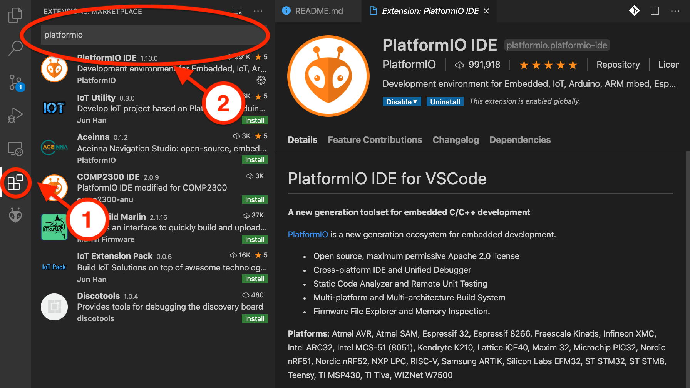
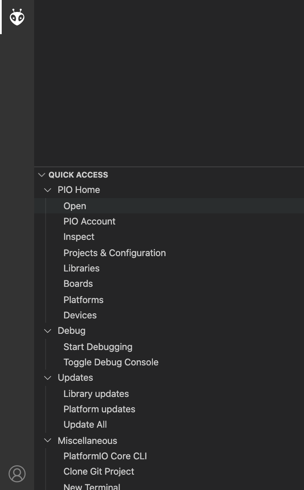
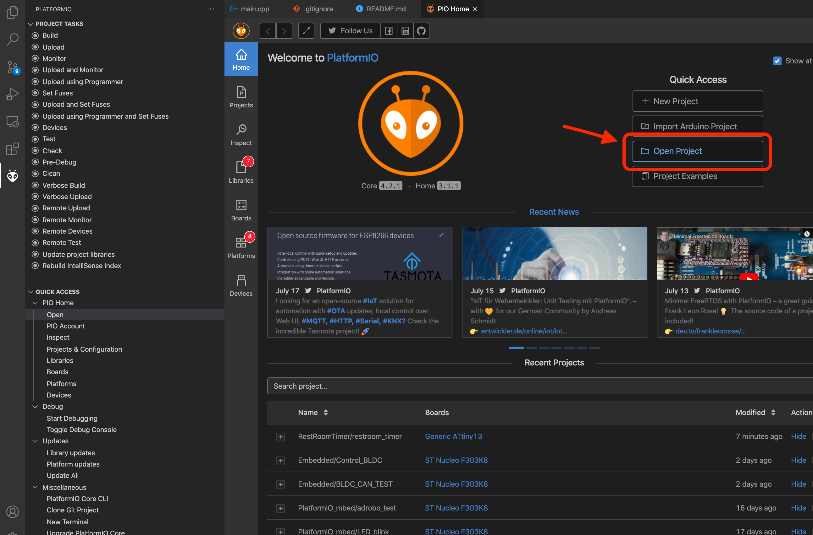
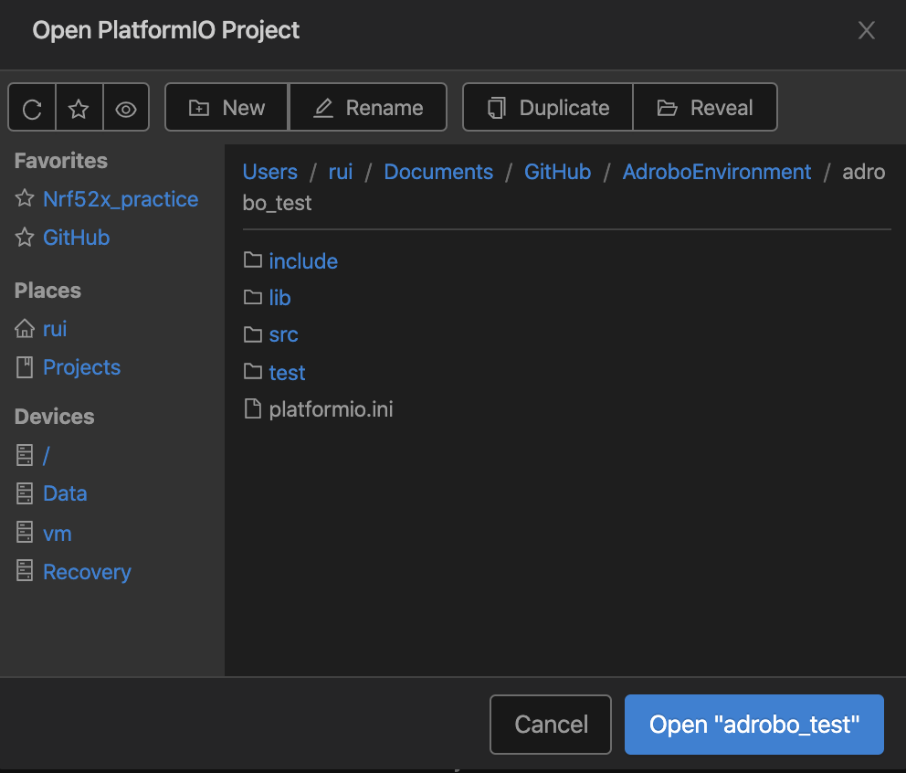

# 未来ロボティクス学科1年生ロボット体験実習
VSCodeを使用した開発環境の構築についてのレポジトリ

質問がある場合は[twitter](https://twitter.com/3pLiendefamille)のDMにて対応します

## 使用するもの
+ VScode
+ PlatformIO

## VScodeのインストール
[ここ](https://code.visualstudio.com/download)にアクセスしてダウンロードしてインストールする

## Platform IO
VScodeの拡張機能でマイコンの開発が可能  

1. VScodeの左にある拡張機能(①)を選択し検索バー(②)に`platformio`を入力
2. PlatformIO IDEを選択してインストールする

## プログラムの開き方
1. 左にある蜂のアイコンを選択

2. PIO HOME > Openを選択
3. 下記のような画面がでるので, OpenProjectを選択

4. ダウンロードしたディレクトリから`adrobo_test`を選択→ボタンに`Open "adrobo_test"`がでる

5. Openを選択するとフォルダが開く

## ビルド&書き込み
### ビルド方法
下記のチェック部分をクリックするとビルドが開始される→SUCCESSが表示されればOK

### 書き込み方法
マイコンと接続した状態で下記の右やじるをクリックする

## Q&A